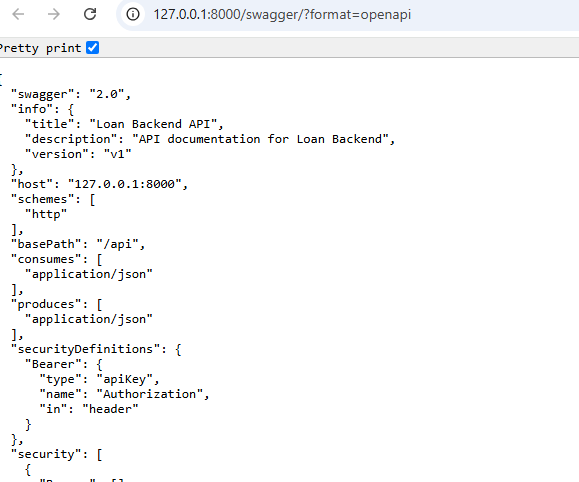
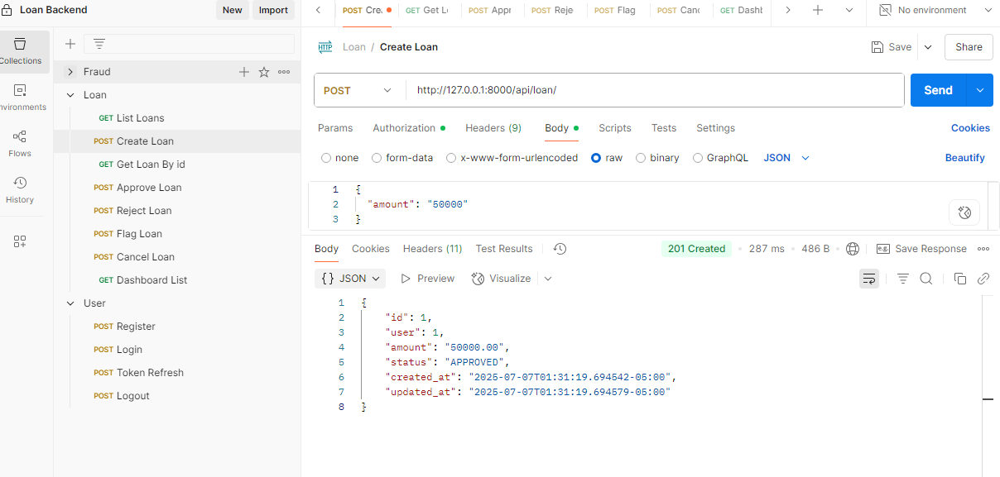

# Django Loan Backend

**A Django REST Framework backend for managing loan applications with fraud detection, admin workflows, strict linting, and type-safe tests.**

## Table of Contents
- [Features](#features)
- [Technologies & Dependencies](#technologies--dependencies)
- [Project Structure](#project-structure)
- [Assumptions & Endpoint Behavior](#assumptions--endpoint-behavior)
- [Fraud Detection Rules](#fraud-detection-rules)
- [Testing & Quality Gates](#testing--quality-gates)
- [API Documentation](#api-documentation)
- [Setup & Running](#setup--running)
  - [Local Development](#local-development)
  - [Docker Deployment](#docker-deployment)
- [Admin User Creation](#admin-user-creation)

## Features
- CRUD endpoints for `LoanApplication` (`POST`, `GET`, `PUT`, `DELETE /loans/`)
- Loan withdrawal endpoint (`POST /loans/{id}/withdraw/`) with custom 403-forbidden logic
- Admin-only actions: approve, reject, flag (`/loans/{id}/approve/`, `/reject/`, `/flag/`)
- Admin dashboard for aggregated statistics
- Fraud detection implemented in [`fraud/services.py`](fraud/services.py:26)
- Caching optimization in fraud views to serve cached pages without unnecessary authentication
- Flake8 compliance (E501 fixes for max 79 characters)
- Mypy static typing across code and tests (`django-stubs` annotations)

## Technologies & Dependencies

### Main Dependencies
- Django 5.2
- Django REST Framework
- Simple JWT authentication ([`djangorestframework-simplejwt`](https://pypi.org/project/djangorestframework-simplejwt/))
- Swagger/OpenAPI docs ([`drf-yasg`](https://pypi.org/project/drf-yasg/))
- CORS handling ([`django-cors-headers`](https://pypi.org/project/django-cors-headers/))
- Redis caching ([`django-redis`](https://pypi.org/project/django-redis/)) with locmem fallback
- PostgreSQL adapter ([`psycopg2`](https://pypi.org/project/psycopg2/)) and SQLite
- 12-factor configuration ([`django-environ`](https://pypi.org/project/django-environ/))
- Gunicorn WSGI server ([`gunicorn`](https://pypi.org/project/gunicorn/))
- WhiteNoise static file serving ([`whitenoise`](https://pypi.org/project/whitenoise/))

### Development Dependencies
- pytest, pytest-django
- flake8
- mypy, django-stubs
- Black, isort

## Project Structure

```
.
├── manage.py
├── Dockerfile
├── docker-compose.yml
├── pyproject.toml
├── .env.example
├── loan_app/
│   ├── __init__.py
│   ├── settings.py
│   ├── urls.py
│   └── wsgi.py
├── users/
│   ├── apps.py
│   ├── urls.py
│   └── views.py
├── loan/
│   ├── apps.py
│   ├── models.py
│   ├── serializers.py
│   └── views.py
├── fraud/
│   ├── apps.py
│   ├── models.py
│   ├── serializers.py
│   └── services.py
└── tests/
    ├── unit/           # Unit tests (models, services, caching, logging, permission, fraud)
    └── integration/    # Integration tests (API flows, admin actions, fraud scenarios)
```

## Assumptions & Endpoint Behavior

**Registration & Authentication:**
- `POST /register/`: Create new user, returns JWT tokens.
- `POST /api/token/`: Obtain access and refresh tokens.
- `POST /api/token/refresh/`: Refresh access token.
- `POST /logout/`: Invalidate refresh tokens.

**Loan Application Workflow:**
1. **Creation** (`POST /loans/`):
   - New `LoanApplication` created with `status = "PENDING"` and includes a purpose.
   - Fraud checks triggered in [`fraud/services.py`](fraud/services.py:26).
2. **Auto-Approval**:  
   - No flags **and** `amount ≤ 1_000_000` sets status to `APPROVED`.
3. **High-Value Review**:  
   - No flags and `amount > 1_000_000` remains `PENDING` for admin review.
4. **Flagging**:  
   - Failing any fraud rule sets `status = "FLAGGED"`.
   - Flags stored in `FraudFlag` and mock notification sent.
5. **User Withdrawal** (`POST /loans/{id}/withdraw/`):
   - Only the loan’s owner can withdraw when `PENDING` (403 forbidden on others).
   - Withdrawn loans cannot be modified.
6. **Admin Actions** (`/approve/`, `/reject/`, `/flag/`):
   - Admins can approve, reject, or flag loans in `PENDING` or `FLAGGED`.
   - 403 forbidden if loan is in any other state.

## Fraud Detection Rules
- **Overuse**: More than 3 loans in past 24h.
- **High Amount**: `amount > 5_000_000`.
- **Email Domain**: More than 10 users share same domain.

See full implementation in [`fraud/services.py`](fraud/services.py:26).

## Testing & Quality Gates
- Unit tests: `pytest tests/unit`
- Integration tests: `pytest tests/integration`
- Full suite: `pytest --maxfail=1 --disable-warnings -q`
- Static typing: `poetry run mypy .`
- Linting: `poetry run flake8`
- Formatting & imports: `black .`, `isort .`

## API Documentation


- Swagger UI: `GET /swagger/`

- Redoc: `GET /redoc/`




- OpenAPI JSON: `GET /swagger.json`

## Setup & Running

### Local Development
1. Clone the repo:
   ```bash
   git clone https://github.com/your-username/loan-backend.git
   ```
2. Enter directory:
   ```bash
   cd loan-backend
   ```
3. Copy environment template:
   ```bash
   cp [.env.example](.env.example:1) .env
   ```
4. Install dependencies:
   ```bash
   poetry install
   ```
5. Apply migrations:
   ```bash
   poetry run python manage.py migrate
   ```
6. Collect static files:
   ```bash
   poetry run python manage.py collectstatic --noinput
   ```
7. Run server:
   ```bash
   poetry run python manage.py runserver
   ```
8. Create an admin user:
   ```bash
   poetry run python manage.py createsuperuser
   ```

### Docker Deployment
1. Build & start containers:
   ```bash
   docker-compose up --build -d
   ```
2. Create admin user in the `web` service:
   ```bash
   docker-compose exec web \
     python manage.py createsuperuser \
       --username admin \
       --email admin@example.com
   ```
3. Stop services:
   ```bash
   docker-compose down
   ```

## Admin User Creation
To test admin-only endpoints (`/approve/`, `/reject/`, `/flag/`), you need a superuser.  
Follow the [Local Development](#local-development) or [Docker Deployment](#docker-deployment) instructions above.





